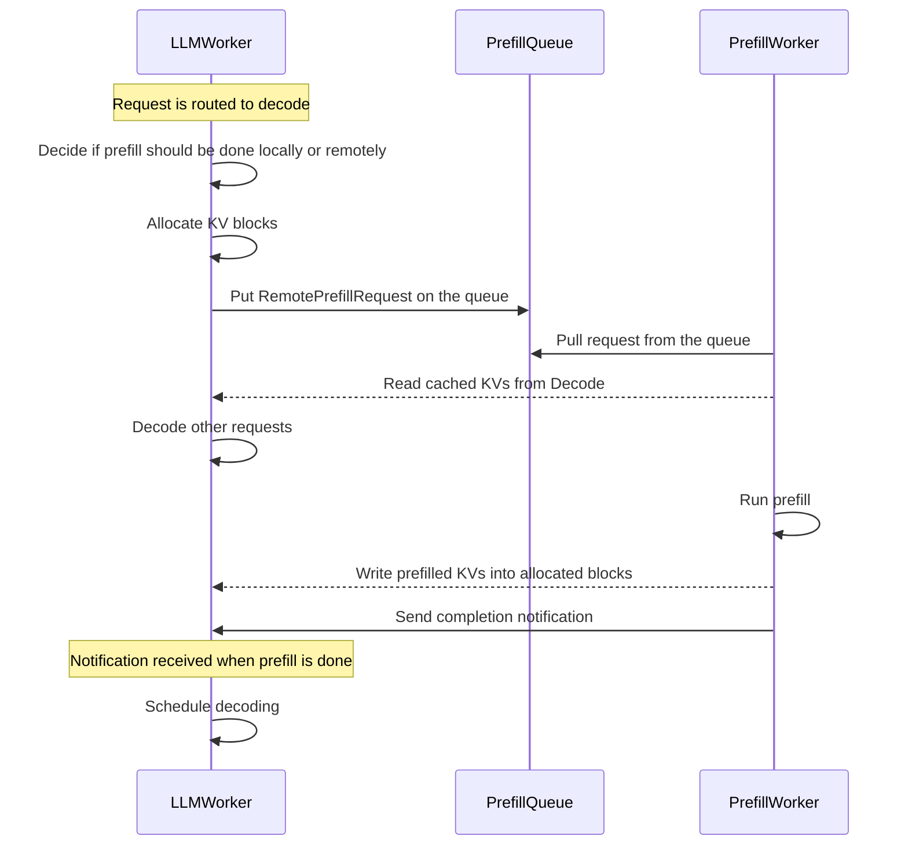

<!--
SPDX-FileCopyrightText: Copyright (c) 2025 NVIDIA CORPORATION & AFFILIATES. All rights reserved.
SPDX-License-Identifier: Apache-2.0

Licensed under the Apache License, Version 2.0 (the "License");
you may not use this file except in compliance with the License.
You may obtain a copy of the License at

http://www.apache.org/licenses/LICENSE-2.0

Unless required by applicable law or agreed to in writing, software
distributed under the License is distributed on an "AS IS" BASIS,
WITHOUT WARRANTIES OR CONDITIONS OF ANY KIND, either express or implied.
See the License for the specific language governing permissions and
limitations under the License.
-->

# LLM Deployment Examples

This directory contains examples and reference implementations for deploying Large Language Models (LLMs) in various configurations.

## Components

- API Server: OpenAI compatible http server handles incoming requests.
- Processor: Handles API requests and routes them to appropriate workers based on specified strategy.
- Router: Handles API requests and routes them to appropriate workers based on specified strategy.
- Worker: Prefill and decode worker handles actual LLM inference.

## Deployment Architectures

### Aggregated
Single-instance deployment where both prefill and decode are done by the same worker.

### Disaggregated
Distributed deployment where prefill and decode are done by separate workers that can scale independently.
The following diagram shows the flow of requests in a disaggregated deployment.
Note that the prefill queue is optional.

## Getting Started

1. Choose a deployment architecture based on your requirements.
2. Configure the components as needed.
3. Deploy using the provided scripts:
   - For vLLM based deployment, refer to [vLLM Deployment](./docs/vllm_deployment.md)
   - For TensorRT-LLM based deployment, refer to [TensorRT-LLM Deployment](./docs/tensorrt_llm_deployment.md)
   - For Multi-node deployment, refer to [Multi-node Deployment](./docs/multi_node_deployment.md)
   - To learn about how to close the deployment, refer to [Close Deployment](../../docs/guides/dynamo_serve.md#close-deployment) section.